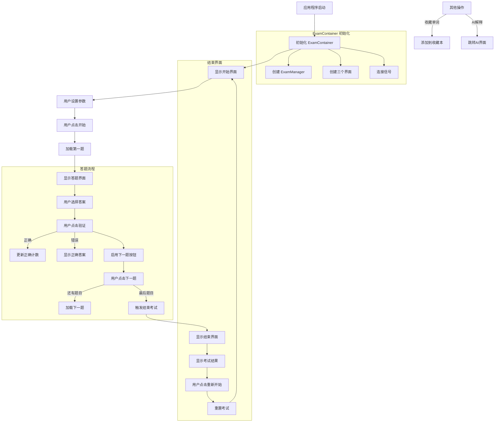
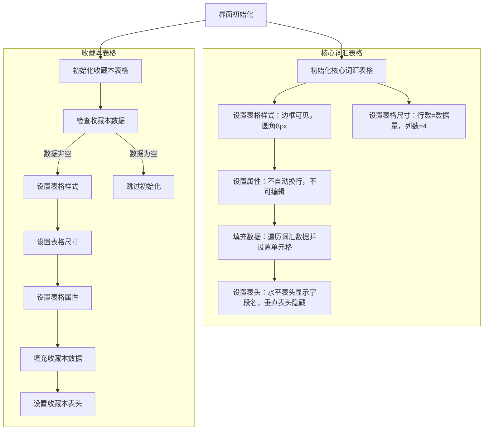
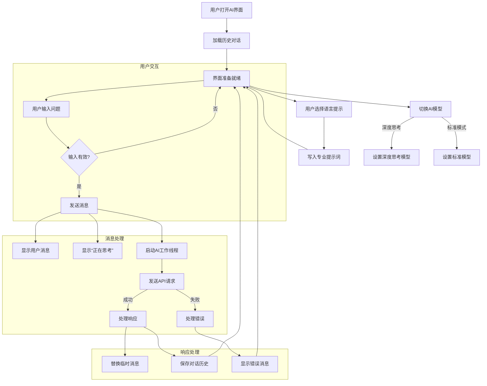

- #### 2.1

- 

  ```mermaid
  graph LR
      A[开始] --> B[输入用户名和密码]
      B --> C{用户名是否为空?}
      C -- 是 --> D[提示'请输入用户名']
      D --> B
      C -- 否 --> E{用户是否存在?}
      E -- 不存在 --> F[注册新用户]
      F --> G[保存到用户字典]
      G --> H[写入文件]
      H --> I[进入主界面]
      E -- 存在 --> J{密码是否正确?}
      J -- 是 --> I[进入主界面]
      J -- 否 --> K[提示'密码错误']
      K --> B
  ```

  ##### 

- #### 2.2

- ```mermaid
  graph LR
      A[开始初始化] --> B[加载用户配置]
      B --> C[创建设置卡片]
      
      C --> D1[ColorSettingCard]
      C --> D2[StrSettingCard]
      C --> D3[HyperlinkCard]
      
      B --> E[创建子界面]
      
      E --> F1[homeInterface]
      E --> F2[exam1Interface]
      E --> F3[exam2Interface]
      E --> F4[aiInterface]
      E --> F5[dataInterface]
      E --> F6[settingInterface]
      
      F6 --> G[添加设置卡片]
      G --> D1
      G --> D2
      G --> D3
      
      B --> H[初始化导航栏]
      H --> I1[添加主页]
      H --> I2[添加常规训练]
      H --> I3[添加复习训练]
      H --> I4[添加AI交互]
      H --> I5[添加数据查看]
      H --> I6[添加设置]
      
      I1 --> F1
      I2 --> F2
      I3 --> F3
      I4 --> F4
      I5 --> F5
      I6 --> F6
      
      H --> J[设置导航图标位置]
      J --> K[配置主窗口]
      
      K --> L[设置窗口大小 1024x768]
      L --> M[窗口居中显示]
      M --> N[显示主界面]
      N --> O[结束初始化]
      
      style A fill:#9f9,stroke:#333
      style O fill:#f9f,stroke:#333
      style B fill:#cdf,stroke:#333
      style C fill:#cdf,stroke:#333
      style D1 fill:#ffb,stroke:#333
      style D2 fill:#ffb,stroke:#333
      style D3 fill:#ffb,stroke:#333
      style F1 fill:#fbb,stroke:#333
      style F2 fill:#fbb,stroke:#333
      style F3 fill:#fbb,stroke:#333
      style F4 fill:#fbb,stroke:#333
      style F5 fill:#fbb,stroke:#333
      style F6 fill:#fbb,stroke:#333
  ```

#### 2.3

- - 

- ```mermaid
  graph LR
      A[创建HomeWidget] --> B[初始化UI布局]
      B --> C[创建功能卡片]
      C --> D[常规训练卡片]
      C --> E[复习训练卡片]
      C --> F[DeepSeek卡片]
      
      B --> G[初始化学习系统]
      G --> H[加载学习数据]
      H --> I[显示统计图表]
      
      B --> J[设置日期信息]
      J --> K[显示当前日期星期]
      
      B --> L[设置进度条]
      L --> M[显示学习进度]
      
      D --> N[绑定切换界面事件]
      E --> N
      F --> N
      
      B --> O[设置刷新按钮]
      O --> P[刷新数据]
      P --> Q[重新加载学习数据]
      Q --> R[更新统计图表]
      Q --> S[更新连续天数]
      Q --> T[更新今日学习量]
      Q --> U[更新进度条]
      Q --> V[保存配置]
      
      style A fill:#9f9,stroke:#333
      style P fill:#f99,stroke:#333
      style N fill:#bbf,stroke:#333
      style I fill:#ffb,stroke:#333
      style M fill:#ffb,stroke:#333
  ```

##### 

#### 2.4

###### 



#### 2.6




#### 2.7

###### 



